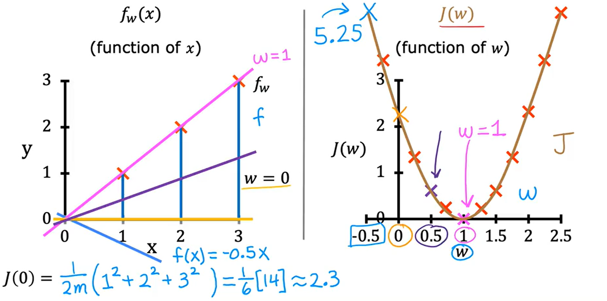
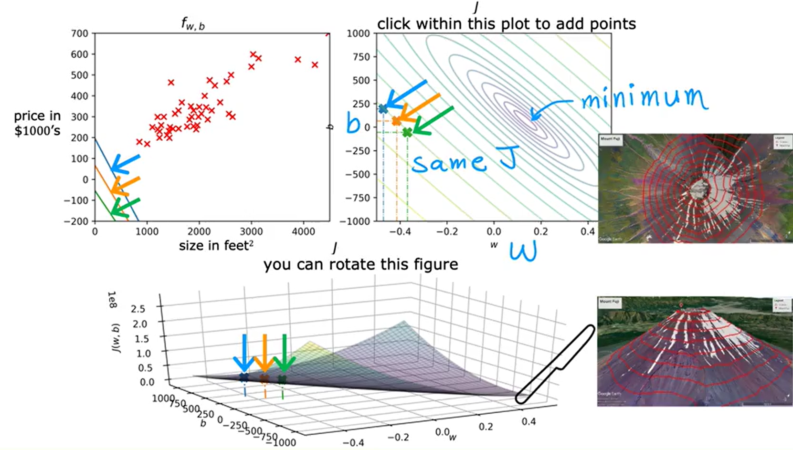
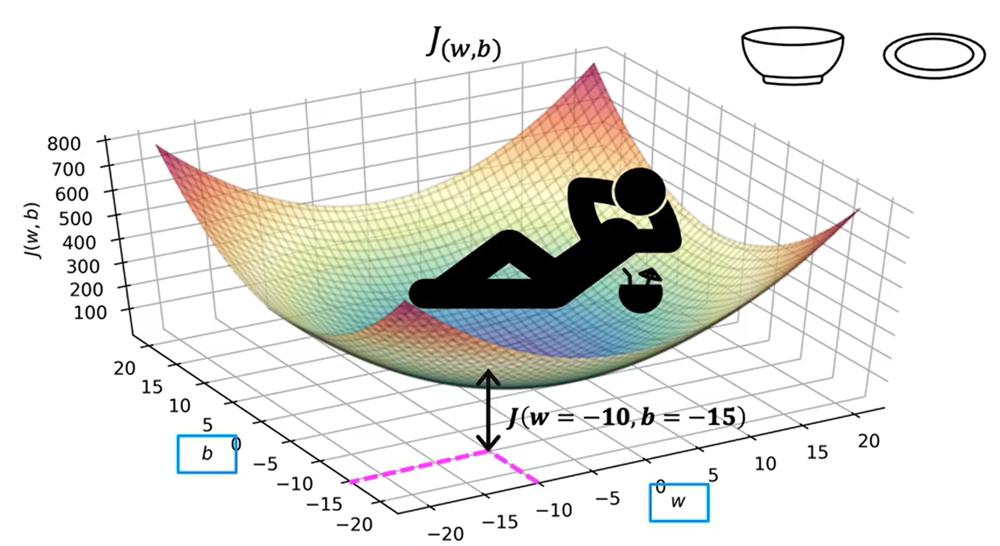
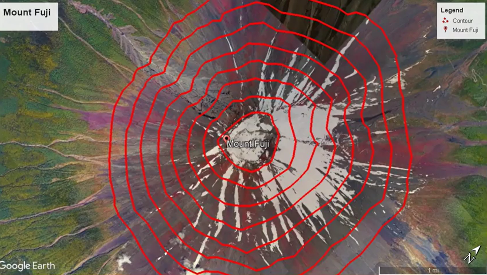
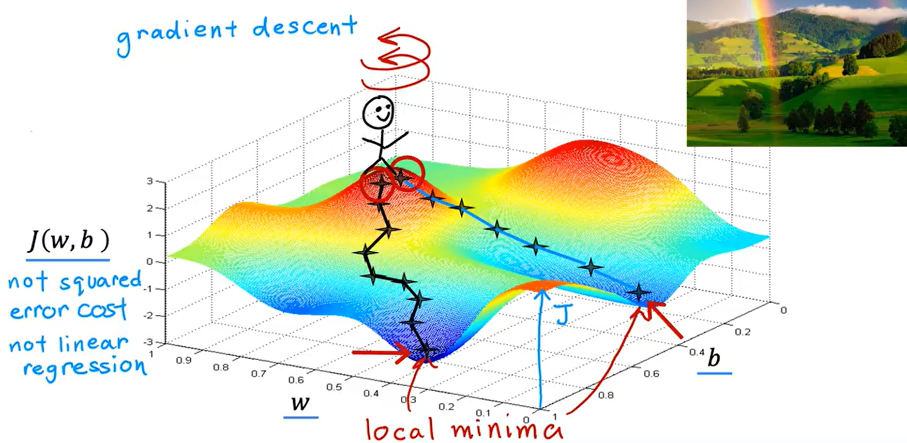

# Week 1: Introduction to Machine Learning

## What is Machine Learning?

> "Field of study that gives computers the ability to learn without being explicitly programmed."
> — Arthur Samuel (1959)

## Machine Learning Algorithms

**Primary types:**
- Supervised Learning
- Unsupervised Learning

**Other algorithms:**
- Recommender Systems
- Reinforcement Learning

## Supervised Learning

Supervised learning refers to algorithms that learn **x → y (input → output)** mappings.

- You train the model with labeled examples: input `x` + correct label `y`
- After training, the model takes a new input `x` it has never seen and predicts the output `y`

> ~99% of the economic value created by ML today comes from supervised learning.

### Real-World Examples

| Input (x) | Output (y) | Application |
|---|---|---|
| Email | Spam / Not spam | Spam filter |
| Audio clip | Text transcript | Speech recognition |
| English text | Another language | Machine translation |
| Ad + user info | Click or not | Online advertising |
| Sensor data + image | Position of other cars | Self-driving cars |
| Photo of product | Defect or not | Visual inspection |

### Types of Supervised Learning

#### Regression
Predicting a **number** from infinitely many possible values.

**Example — Housing Price Prediction:**
- Input `x`: size of house (sq ft)
- Output `y`: price (in $1,000s)
- You can fit a **straight line** or a **curve** to the data — choosing the right fit is something the algorithm learns to do systematically

#### Classification

Predicting a **category** from a **small, finite set** of possible outputs (classes/categories).

> Classification predicts discrete categories — not all possible numbers in between like 0.5 or 1.7.

**Example — Breast Cancer Detection**

| Input (x) | Output (y) |
|---|---|
| Tumor size | 0 = Benign, 1 = Malignant |

- The learning algorithm finds a **boundary** that separates classes in the data.
- Unlike regression, there are only a **small number of possible output categories** (e.g. 0 or 1).

**More than two output categories:**

The algorithm can also predict multiple cancer types, e.g.:
- `0` — Benign
- `1` — Malignant Type 1
- `2` — Malignant Type 2

**Multiple inputs:**

You can use more than one input feature to improve predictions:

| Input Features (x) | Output (y) |
|---|---|
| Tumor size + Patient age | 0 = Benign, 1 = Malignant |

With two inputs, the learning algorithm finds a **boundary line** through 2D space to separate classes.

In practice, many more inputs may be used (e.g. tumor clump thickness, cell size uniformity, cell shape uniformity, etc.).

## Unsupervised Learning

In unsupervised learning, data has **no output labels `y`**. The algorithm must find **structure, patterns, or something interesting** in the data entirely on its own.

| | Supervised Learning | Unsupervised Learning |
|---|---|---|
| Data | Labeled (x + y) | Unlabeled (x only) |
| Goal | Predict correct output | Discover structure/patterns |
| Example | Benign vs. Malignant (labeled) | Group patients by similarity (no labels) |

> We call it "unsupervised" because we don't supervise the algorithm with right answers — it figures out patterns by itself.

### Types of Unsupervised Learning

#### Clustering

A **clustering algorithm** groups unlabeled data into clusters (groups) automatically, without being told what the groups are in advance.

**Example 1 — Google News**

- Every day, Google News scans hundreds of thousands of articles on the internet.
- A clustering algorithm groups related stories together based on similar words (e.g. "panda", "twins", "zoo").
- No human tells the algorithm which words define a cluster — it figures this out on its own, every single day.

**Example 2 — DNA Microarray Data**

- Each column = one person's genetic data; each row = a particular gene.
- Colors (red, green, gray, etc.) show the degree to which a gene is active in each individual.
- Clustering groups individuals into types (e.g. Type 1, Type 2, Type 3) based on gene expression patterns.
- The algorithm is not told what the types are in advance — it discovers them automatically.

**Example 3 — Market Segmentation**

- Given a large customer database, clustering can automatically group customers into market segments.
- Example: the deeplearning.ai community was clustered into distinct groups:
  - **Group 1** — Seeking knowledge to grow their skills
  - **Group 2** — Looking to develop their career (promotion, new job)
  - **Group 3** — Wanting to stay updated on how AI impacts their field

### Formal Definition of Unsupervised Learning

- **Supervised learning** — data comes with both inputs `x` and output labels `y`.
- **Unsupervised learning** — data comes with **only inputs `x`**, no labels `y`. The algorithm must find structure, patterns, or something interesting in the data on its own.

#### Anomaly Detection

Used to detect **unusual events** — data points that don't fit normal patterns.

- **Fraud detection** in the financial system — unusual transactions can be signs of fraud.
- Useful across many other applications where rare/abnormal events matter.

#### Dimensionality Reduction

Takes a **big dataset** and compresses it into a **much smaller dataset** while losing as little information as possible.

> Almost magically shrinks data while preserving its essence — useful for visualization, storage, and speeding up other algorithms.

### Check Your Understanding — Supervised vs. Unsupervised

| Problem | Type | Why |
|---|---|---|
| Spam filtering (emails labeled spam / not spam) | **Supervised** | Labeled data: `x` = email, `y` = spam/not spam |
| Grouping news articles (e.g. Google News) | **Unsupervised** | No labels — cluster similar stories |
| Market segmentation from customer data | **Unsupervised** | Algorithm discovers segments automatically |
| Diagnosing diabetes (diabetic / not diabetic) | **Supervised** | Labeled data, just like benign/malignant tumor classification |

### Summary of Unsupervised Learning Types Covered

1. **Clustering** — group similar data points together
2. **Anomaly detection** — find unusual data points
3. **Dimensionality reduction** — compress data while keeping information

> Clustering, anomaly detection, and dimensionality reduction will all be explored more deeply later in the specialization.

---

## Linear Regression Model

**Linear regression** = fitting a **straight line** to your data. It's probably the most widely used learning algorithm in the world today, and the concepts here carry over to other ML models later in the specialization.

### Motivating Example — Predicting House Prices (Portland, USA)

- **Goal**: estimate the price of a client's house based on its size.
- **Dataset**: house sizes and prices from Portland.
- **Plot**: horizontal axis = size (sq ft), vertical axis = price ($1,000s). Each cross = one house.
- **Use**: fit a straight line to the data, then read off the predicted price for a new house (e.g. 1250 sq ft → ~$220,000).

> This is **supervised learning** because the training data includes "right answers" — each house comes with its actual sale price.

### Regression vs. Classification (Recap)

| | Regression | Classification |
|---|---|---|
| Output type | A **number** | A **category** |
| Possible outputs | **Infinitely many** | **Small, finite set** |
| Examples | $220,000 / 1.5 / -33.2 | Cat vs. dog, disease vs. no disease |

> Linear regression is **one example** of a regression model — others exist and will appear in Course 2.

### Training Set

The **training set** is the dataset used to train the model.

- The client's house is **not** in the training set — its price is unknown (that's what we're predicting).
- Workflow: train the model on the training set → use the trained model to predict on new inputs.

### Standard Notation

This notation is standard across AI/ML — you'll see it repeatedly throughout the specialization.

| Symbol | Meaning | Also called |
|---|---|---|
| `x` | Input variable | Feature / input feature |
| `y` | Output variable | Target variable |
| `m` | Total number of training examples | — |
| `(x, y)` | A **single** training example | — |
| `(x⁽ⁱ⁾, y⁽ⁱ⁾)` | The **i-th** training example (row `i`) | — |

**Example — Portland dataset:**

| i | x⁽ⁱ⁾ (size, sq ft) | y⁽ⁱ⁾ (price, $1,000s) |
|---|---|---|
| 1 | 2,104 | 400 |
| ... | ... | ... |
| 47 | ... | ... |

Here `m = 47`, and for the first training example `x⁽¹⁾ = 2104`, `y⁽¹⁾ = 400`.

> ⚠️ **The superscript `(i)` is NOT exponentiation.** `x⁽²⁾` means "the second training example" — not `x²` (x squared). It's just an **index** into the training set.

---

## How Supervised Learning Works

### The Workflow

```
Training set  ──►  Learning algorithm  ──►  Function  f  (the model)
(features x +
 targets y)

New input  x  ──►  f  ──►  ŷ  (prediction / estimate of y)
```

- Feed the **training set** (input features `x` + output targets `y`) into the **learning algorithm**.
- The algorithm produces a **function `f`** — this is the **model**.
- Historically `f` was called a *hypothesis*; in this course we just call it the **function f**.
- Given a new input `x`, the model outputs `ŷ` (read as **"y-hat"**) — the prediction.

### `y` vs. `ŷ` — Target vs. Prediction

| Symbol | Meaning |
|---|---|
| `y` | The **actual true value** (target) — from the training set |
| `ŷ` | The model's **estimate / prediction** for `y` — may or may not equal the true value |

> When helping a client sell a house, the **true price** is unknown until it sells. The model's `ŷ` is the **estimated price** given the house's features.

### How Do We Represent `f`?

A key design question: **what math formula computes `f`?**

For now, we stick with `f` as a **straight line**:

$$
f_{w,b}(x) = wx + b
$$

- `w` and `b` are **numbers** (parameters); their values determine the prediction `ŷ`.
- Shorthand: write `f(x)` instead of `f_{w,b}(x)` — same meaning.
- Plot: `x` on horizontal axis, `y` on vertical axis. The algorithm finds the **best-fit straight line** through the training points.

### Why a Linear Function?

- A line is **simple and easy to work with**.
- It serves as a **foundation** for more complex non-linear models (curves, parabolas, etc.) introduced later.

### Naming the Model

| Name | Meaning |
|---|---|
| **Linear regression** | The model `f(x) = wx + b` |
| **Linear regression with one variable** | A single input feature `x` (e.g. just house size) |
| **Univariate linear regression** | Same thing — *uni* = one (Latin), *variate* = variable |

> Later: **multivariate** linear regression — predicting from multiple features (size, # bedrooms, etc.).

---

## Optional Lab — Notation Cheat Sheet

| Math | Description | Python |
|---|---|---|
| `a` (non-bold) | scalar | `a` |
| **a** (bold) | vector | `a` (numpy array) |
| `x` | training feature values (size in 1000 sqft) | `x_train` |
| `y` | training targets (price in $1000s) | `y_train` |
| `x⁽ⁱ⁾`, `y⁽ⁱ⁾` | i-th training example | `x_i`, `y_i` |
| `m` | number of training examples | `m` |
| `w` | parameter — **weight** | `w` |
| `b` | parameter — **bias** | `b` |
| `f_{w,b}(x⁽ⁱ⁾)` | model output at `x⁽ⁱ⁾` | `f_wb` |

> Implementation lives in [univariate-lr-implementation.py](univariate-lr-implementation.py).

---

## Cost Function

To implement linear regression, the first key step is to define a **cost function** — a way to measure **how well the model is doing** so we can adjust it to do better.

### Recap — Model and Parameters

We have a training set of input features `x` and output targets `y`, and we fit a linear function:

$$
f_{w,b}(x) = wx + b
$$

- `w` and `b` are the **parameters** of the model.
- **Parameters** = variables you can adjust during training to improve the model.
- Also called **coefficients** or **weights**.

### What `w` and `b` Do

Different values of `w` and `b` produce different functions `f(x)` — different lines on the graph.

| `w` | `b` | `f(x)` | Behavior |
|---|---|---|---|
| 0 | 1.5 | `f(x) = 1.5` | Horizontal line — always predicts 1.5. `b` is the **y-intercept** (where the line crosses the y-axis). |
| 0.5 | 0 | `f(x) = 0.5x` | Passes through origin. `w` is the **slope** (rise/run = 0.5). |
| 0.5 | 1 | `f(x) = 0.5x + 1` | Crosses y-axis at `b = 1`. Slope is still `w = 0.5`. |

> `w` controls the **slope**; `b` controls the **y-intercept**.

### Goal of Linear Regression

Choose values of `w` and `b` so that the line `f(x) = wx + b` **fits the training data well** — i.e. passes through or close to the training examples.

### Predictions vs. Targets

| Symbol | Meaning |
|---|---|
| `(x⁽ⁱ⁾, y⁽ⁱ⁾)` | The **i-th training example** — `y⁽ⁱ⁾` is the true target |
| `ŷ⁽ⁱ⁾` | The model's **prediction** for `x⁽ⁱ⁾`: `ŷ⁽ⁱ⁾ = f_{w,b}(x⁽ⁱ⁾) = wx⁽ⁱ⁾ + b` |

**Question:** how do we find `w` and `b` so that `ŷ⁽ⁱ⁾` is close to `y⁽ⁱ⁾` for many (ideally all) training examples?

### Building the Cost Function — Step by Step

1. **Error for one example** — how far off the prediction is from the target:

   ```math
   \text{error}^{(i)} = \hat{y}^{(i)} - y^{(i)}
   ```

2. **Squared error** — square it so positive and negative errors don't cancel out, and large errors are penalized more:

   ```math
   (\hat{y}^{(i)} - y^{(i)})^2
   ```

3. **Sum across all training examples** (`i = 1` to `m`):

   ```math
   \sum_{i=1}^{m} (\hat{y}^{(i)} - y^{(i)})^2
   ```

   ⚠️ Problem: more training examples → bigger sum, even if the model is equally good. We don't want the cost to grow with dataset size.

4. **Average squared error** — divide by `m`:

   ```math
   \frac{1}{m} \sum_{i=1}^{m} (\hat{y}^{(i)} - y^{(i)})^2
   ```

5. **By convention, divide by `2m`** — the extra factor of 2 makes later derivative calculations cleaner. The cost function works either way.

### The Squared Error Cost Function

$$
J(w, b) = \frac{1}{2m} \sum_{i=1}^{m} \left( \hat{y}^{(i)} - y^{(i)} \right)^2
        = \frac{1}{2m} \sum_{i=1}^{m} \left( f_{w,b}(x^{(i)}) - y^{(i)} \right)^2
$$

- `J(w, b)` is the **cost function**.
- Called the **squared error cost function** because we square the error terms.
- **By far the most common** cost function for linear regression and regression problems in general.

### Intuition

| `J(w, b)` value | Meaning |
|---|---|
| Small | Predictions are close to targets — model fits the data well |
| Large | Predictions are far from targets — model fits the data poorly |

> Our goal: find values of `w` and `b` that **minimize** `J(w, b)`.

---

## Cost Function — Intuition

The cost function `J` measures the gap between the model's predictions and the actual targets. Linear regression's job is to find `w` and `b` that make `J` as small as possible:

$$
\underset{w,b}{\text{minimize}} \; J(w, b)
$$

### Simplified Model — Set `b = 0`

To build intuition visually, drop the `b` parameter (set `b = 0`). The model becomes:

$$
f_w(x) = wx
$$

- Only **one** parameter to tune: `w`.
- The line is forced to pass through the **origin** (when `x = 0`, `f(x) = 0`).
- Cost function simplifies to a function of `w` alone:

$$
J(w) = \frac{1}{2m} \sum_{i=1}^{m} \left( w \cdot x^{(i)} - y^{(i)} \right)^2
$$

**Goal:** find the `w` that minimizes `J(w)`.

### Two Graphs Side-by-Side

There are **two different plots** to keep straight — they're related but show different things:

| Plot | Horizontal axis | Vertical axis | What it shows |
|---|---|---|---|
| **Model** `f_w(x)` | `x` (input feature) | `y` (output) | A straight line for a **fixed** `w` |
| **Cost** `J(w)` | `w` (parameter) | `J` (cost) | How cost varies as `w` changes |

> For each value of `w`, you get **one line** on the left plot and **one point** on the right plot.

### Worked Example — Training Set `(1,1), (2,2), (3,3)`

Three points lying perfectly on the line `y = x`. Let's compute `J(w)` for several values of `w`.

#### Case 1 — `w = 1`

The line `f(x) = x` passes through all three points exactly.

| i | x⁽ⁱ⁾ | y⁽ⁱ⁾ | f(x⁽ⁱ⁾) = 1·x⁽ⁱ⁾ | error² |
|---|---|---|---|---|
| 1 | 1 | 1 | 1 | 0² |
| 2 | 2 | 2 | 2 | 0² |
| 3 | 3 | 3 | 3 | 0² |

$$
J(1) = \frac{1}{2 \cdot 3} (0 + 0 + 0) = 0
$$

> Perfect fit → cost is zero.

#### Case 2 — `w = 0.5`

The line `f(x) = 0.5x` has a shallower slope. Each prediction undershoots the target.

| i | x⁽ⁱ⁾ | y⁽ⁱ⁾ | f(x⁽ⁱ⁾) = 0.5·x⁽ⁱ⁾ | error² |
|---|---|---|---|---|
| 1 | 1 | 1 | 0.5 | (0.5 − 1)² = 0.25 |
| 2 | 2 | 2 | 1.0 | (1 − 2)² = 1 |
| 3 | 3 | 3 | 1.5 | (1.5 − 3)² = 2.25 |

$$
J(0.5) = \frac{1}{2 \cdot 3} (0.25 + 1 + 2.25) = \frac{3.5}{6} \approx 0.58
$$

#### Case 3 — `w = 0`

The line `f(x) = 0` is horizontal, sitting on the x-axis.

$$
J(0) = \frac{1}{2 \cdot 3} (1^2 + 2^2 + 3^2) = \frac{14}{6} \approx 2.33
$$

#### Case 4 — `w = −0.5`

Downward-sloping line — predictions are way off.

$$
J(-0.5) \approx 5.25
$$

### Plotting `J(w)`

Repeating this calculation across a range of `w` values traces out the shape of `J(w)`:

| `w` | `J(w)` |
|---|---|
| −0.5 | ~5.25 |
| 0 | ~2.33 |
| 0.5 | ~0.58 |
| 1 | 0 |
| 1.5 | ~0.58 |
| 2 | ~2.33 |



The plot is a **U-shaped (parabolic) curve** with its minimum at `w = 1`.

### Key Insight

> Each value of `w` corresponds to:
> - a different **line** on the model plot, **and**
> - a single **point** on the cost plot.
>
> The `w` that minimizes `J(w)` produces the line that best fits the training data.

For this training set, `w = 1` minimizes `J` and gives the best-fitting line — exactly what we'd expect.

### Generalizing Back to Two Parameters

In the full linear regression problem with **both** `w` and `b`:

- Goal: find `w` and `b` that minimize `J(w, b)`.
- Same idea — the cost surface is now 3D (a function of two parameters) instead of a 2D curve.
- Visualized as a **3D bowl-shaped surface** or as **contour plots**.

---

## Cost Function Visualization With `w` and `b`

Previously, we simplified the visualization by setting `b = 0`, so the cost function depended only on `w`:

$$
J(w)
$$

Now return to the full linear regression model:

$$
f_{w,b}(x) = wx + b
$$

The cost function depends on both parameters:

$$
J(w, b)
$$



### Example Model Choice

For the housing-price training set, suppose we choose:

$$
w = 0.06, \quad b = 50
$$

Then:

$$
f(x) = 0.06x + 50
$$

This line is a poor fit for the training data because it consistently underestimates house prices. That means this choice of `w` and `b` gives a relatively large value of `J(w, b)`.

### From a U-Shaped Curve to a 3D Bowl

When there was only one parameter, `w`, the cost function `J(w)` could be drawn as a 2D U-shaped curve.

With two parameters, `w` and `b`, the cost function becomes a 3D surface:

- The horizontal axes are `w` and `b`.
- The vertical axis is the cost `J(w, b)`.
- Each point on the surface represents one particular choice of `w` and `b`.
- The height of the surface at that point is the cost for that choice.



For example, if:

$$
w = -10, \quad b = -15
$$

then the surface height above that point is:

$$
J(-10, -15)
$$

The surface is shaped like a bowl, curved plate, or hammock. The lowest point of the bowl is the minimum cost.

> Linear regression's goal is to find the values of `w` and `b` at the bottom of this bowl.

### Contour Plots

A 3D surface can be hard to read, so we can show the same cost function using a **contour plot**.

A contour plot is like a topographic map:



- Imagine slicing the 3D cost surface horizontally at different heights.
- Each slice gives all points with the same cost value.
- Viewed from above, these slices appear as ovals or ellipses.

In the contour plot:

| Axis | Meaning |
|---|---|
| Horizontal axis | `w` |
| Vertical axis | `b` |
| Each oval | All `(w, b)` pairs with the same `J(w, b)` |
| Center of the ovals | Minimum of the cost function |

So, different points on the same oval can have different values of `w` and `b`, and therefore different model lines `f(x)`, but they all have the same cost.

### Key Insight

> A contour plot is a 2D, top-down view of the same 3D cost surface.

The smallest oval is closest to the bottom of the bowl. Its center marks the parameter values that minimize `J(w, b)` and give the best-fitting line for the training data.

---

## Gradient Descent

So far we've **described** cost — but how do we **systematically find** the `w` and `b` that minimize `J(w, b)`? The answer is **gradient descent**, one of the most important algorithms in all of machine learning.

> Gradient descent is used everywhere — not just for linear regression, but for training advanced neural networks (deep learning) too.

### What Gradient Descent Does

Gradient descent is a general-purpose algorithm to **minimize any function**, not just the squared error cost.

For a cost function with many parameters:

$$
J(w_1, w_2, \dots, w_n, b)
$$

the goal is to pick values of `w_1, ..., w_n, b` that give the smallest possible `J`.

### The Algorithm at a High Level

1. **Start with an initial guess** for `w` and `b`.
   - For linear regression, the starting values don't matter much.
   - Common choice: `w = 0`, `b = 0`.
2. **Repeatedly tweak** `w` and `b` a little bit to reduce `J(w, b)`.
3. **Stop** when `J` settles at or near a minimum.

### The Hill-Descent Analogy

Imagine the cost surface `J(w, b)` as a hilly outdoor landscape:

- **Hills** = high cost (bad `w`, `b` choices).
- **Valleys** = low cost (good `w`, `b` choices).
- You're standing on the hill at your current `(w, b)`.
- **Goal:** get to the bottom of a valley as efficiently as possible.



At each step, gradient descent does this:

1. **Look around 360°** at your current spot.
2. Find the **direction of steepest descent** — the direction in which a tiny step takes you downhill **fastest**.
3. Take a small step in that direction.
4. Repeat.

Eventually you reach the bottom of a valley — a **local minimum**.

### Local Minima

Some cost surfaces (like the one shown above, which is **not** a squared error cost) have **multiple valleys**:

| Concept | Meaning |
|---|---|
| **Local minimum** | The bottom of *a* valley — lowest point in its neighborhood, but not necessarily the lowest point overall |
| **Global minimum** | The absolute lowest point on the entire surface |

> ⚠️ **Where you start matters.** Starting at slightly different `(w, b)` can lead gradient descent to a **different local minimum**. Once you commit to walking down one valley, gradient descent won't climb back up to find another.

### Squared Error Cost Is Special

The image above is a **non-squared-error** cost — the kind you'd see when training a neural network. It has multiple local minima.

For **linear regression with the squared error cost function**, the surface is always a single bowl/hammock shape — there is **only one minimum** (the global minimum). So gradient descent will always find the best `(w, b)` regardless of where you start.

### Key Insight

> Gradient descent = repeatedly take a small step in the direction of steepest descent until you reach a minimum. The math behind "direction of steepest descent" comes from calculus (partial derivatives) — covered in the next section.

---

## Implementing Gradient Descent

The gradient descent algorithm updates each parameter on every step:

$$
w := w - \alpha \, \frac{\partial}{\partial w} J(w, b)
$$

$$
b := b - \alpha \, \frac{\partial}{\partial b} J(w, b)
$$

You repeat both updates until the algorithm **converges** — i.e. `w` and `b` stop changing much from one step to the next, meaning you've reached a local minimum.

### `=` Means Assignment, Not Equality

In this algorithm, `=` is the **assignment operator**, not a truth assertion.

| Context | Meaning of `=` |
|---|---|
| Programming (`a = c`) | **Assign** the value of `c` into the variable `a` |
| Programming (`a = a + 1`) | Increment `a` by 1 — perfectly valid |
| Math (truth assertion) | Claim that two values **are** equal — `a = a + 1` would be nonsense |
| Python equality test | Written `==` (e.g. `a == c`) |

> In these notes the `=` sign in update rules always means **assignment** — the left side is being **set** to whatever the right side evaluates to.

### The Learning Rate `α`

`α` (Greek letter **alpha**) is the **learning rate** — a small positive number, typically between 0 and 1 (e.g. `0.01`).

| `α` size | Effect |
|---|---|
| **Large** | Aggressive gradient descent — big steps downhill |
| **Small** | Cautious gradient descent — tiny baby steps downhill |

> Choosing a good learning rate matters a lot — covered in detail later.

### The Derivative Term

The term `∂J/∂w` (and `∂J/∂b`) is the **derivative** of the cost function with respect to that parameter.

For now, treat the derivative as a black box that tells you:

1. **Which direction** to step in (the direction of steepest descent).
2. Combined with `α`, **how big** that step should be.

> You don't need calculus to use gradient descent — the next section builds intuition for what the derivative is doing.

### Simultaneous Update — The Correct Way

For gradient descent to be implemented correctly, you must update `w` and `b` **simultaneously**. This means: compute the new values for **both** parameters using the **current** values, then assign them.

#### Correct (simultaneous)

```
temp_w = w - α * ∂J(w, b)/∂w
temp_b = b - α * ∂J(w, b)/∂b
w = temp_w
b = temp_b
```

Both derivative terms are evaluated using the **pre-update** `w` and `b`. The new values are stored in temp variables first, then applied together.

#### Incorrect (non-simultaneous)

```
temp_w = w - α * ∂J(w, b)/∂w
w = temp_w                       ← w is updated BEFORE computing temp_b
temp_b = b - α * ∂J(w, b)/∂b    ← uses the NEW w, not the original
b = temp_b
```

Here, the derivative for `b` is computed using the **already-updated** `w`. That changes the math: `temp_b` is not the same value it would have been in the simultaneous version, and the resulting `b` differs too.

### Why Simultaneous Matters

| | Simultaneous (correct) | Non-simultaneous (incorrect) |
|---|---|---|
| Inputs to both derivatives | Original `w`, `b` | Original `w`, `b` — then updated `w`, original `b` |
| What's being optimized | Gradient descent on `J(w, b)` | A different algorithm with different properties |
| Convention | This is what "gradient descent" means | Might work in practice but is technically wrong |

> When people say "gradient descent," they always mean the **simultaneous** version. Stick to that.

### Key Insight

> Gradient descent repeatedly nudges every parameter in the direction that decreases `J` the most, with all parameters updated together using the values from the start of the step. The learning rate `α` controls step size; the derivative controls direction and magnitude.

---

## Gradient Descent — Derivative Intuition

To build intuition for **why** the derivative term in gradient descent makes the algorithm move toward the minimum, simplify the problem to a single parameter.

### Simplified Setup — One Parameter

Drop `b` and consider a cost function of just `w`:

$$
J(w)
$$

The update rule becomes:

$$
w := w - \alpha \, \frac{d}{dw} J(w)
$$

This lets us plot `J(w)` as a **2D curve** (horizontal axis = `w`, vertical axis = `J`) instead of a 3D surface.

> Technically `∂/∂w` is the **partial derivative** and `d/dw` is the ordinary derivative. For implementing ML algorithms the distinction doesn't matter — both are referred to as "the derivative."

### What the Derivative Actually Is

At any point on the curve `J(w)`, draw the **tangent line** — a straight line that just touches the curve at that point.

- The **slope** of that tangent line **is** the derivative `d/dw J(w)` at that point.
- Slope = height ÷ width of a small triangle drawn along the tangent.

| Tangent direction | Slope sign | Derivative sign |
|---|---|---|
| Up and to the right | Positive (e.g. 2/1 = 2) | `> 0` |
| Down and to the right | Negative (e.g. −2/1 = −2) | `< 0` |

### Case 1 — Start to the Right of the Minimum (Positive Slope)

You initialize `w` at a point where the tangent slopes **up and to the right**. The derivative is **positive**.

$$
w := w - \alpha \cdot (\text{positive number})
$$

- `α` is always positive, so you're **subtracting a positive number** from `w`.
- → `w` **decreases** (moves **left** on the graph).
- Moving left from this point brings you **closer to the minimum** — cost goes down.

✓ Correct behavior.

### Case 2 — Start to the Left of the Minimum (Negative Slope)

You initialize `w` at a point where the tangent slopes **down to the right**. The derivative is **negative**.

$$
w := w - \alpha \cdot (\text{negative number})
$$

- Subtracting a negative number = **adding** a positive number.
- → `w` **increases** (moves **right** on the graph).
- Moving right from this point brings you **closer to the minimum** — cost goes down.

✓ Correct behavior.

### Why This Always Works

| Side of minimum | Slope sign | Update direction | Result |
|---|---|---|---|
| Right of min | Positive | `w` decreases | Moves toward min |
| Left of min | Negative | `w` increases | Moves toward min |

> The **sign** of the derivative automatically tells gradient descent which way to step. The **magnitude** of the derivative (combined with `α`) controls how big the step is.

### Key Insight

> The derivative encodes both **which way is downhill** and **how steep the slope is** at your current point. Subtracting `α × derivative` always nudges `w` in the direction that reduces `J` — regardless of which side of the minimum you start on.

> Next: how the choice of learning rate `α` affects convergence — what goes wrong if it's too small or too big.

---

## Gradient Descent — Learning Rate Intuition

The learning rate `α` has a **huge** impact on whether gradient descent works well, works slowly, or doesn't work at all. The update rule is unchanged:

$$
w := w - \alpha \, \frac{d}{dw} J(w)
$$

What changes is how `α` is chosen.

### If `α` Is Too Small

Multiplying the derivative by something like `0.0000001` makes every step minuscule.

- Each step **does** move `w` in the right direction (downhill).
- But the steps are so tiny that you need an enormous number of them to reach the minimum.
- **Result:** gradient descent still works, but is **extremely slow**.

> Symptom: cost `J` keeps going down, but the trajectory inches forward step-by-step over many, many iterations.

### If `α` Is Too Large

Now the steps are massive. Starting near the minimum:

1. The derivative points toward the minimum, but `α` makes you **overshoot it** — you land far on the other side, **at a higher cost than where you started**.
2. The derivative at the new point points back the other way — but `α` is still too large, so you overshoot **again**, landing even further out.
3. Each step takes you **further from the minimum**, not closer.

**Result:** gradient descent may **fail to converge** — and can even **diverge** (cost grows over time).

| `α` size | Behavior |
|---|---|
| Too small | Converges, but painfully slowly |
| Too large | Overshoots the minimum; may oscillate or diverge |
| Just right | Steady, efficient descent to the minimum |

### What Happens at a Local Minimum?

Suppose `w` is already at a local minimum (e.g. `w = 5`). What does one more gradient descent step do?

At a local minimum, the tangent line is **horizontal**, so:

$$
\frac{d}{dw} J(w) = 0
$$

Plug this into the update:

$$
w := w - \alpha \cdot 0 = w
$$

`w` doesn't change. Gradient descent **leaves the parameter alone** — which is exactly what you want once you've found a minimum.

> If your parameters have already reached a local minimum, further gradient descent steps do nothing. The solution stays put.

### Why a Fixed `α` Still Reaches the Minimum

You might expect that with a constant `α`, gradient descent would overshoot once it gets close. It doesn't — and here's why.

As you approach a local minimum, the curve **flattens out**. Each step looks like this:

| Step | Slope (derivative) | Step size = `α × derivative` |
|---|---|---|
| 1 — far from min | Steep | Large step |
| 2 — closer | Less steep | Smaller step |
| 3 — closer still | Even less steep | Even smaller step |
| ... | → 0 | → 0 |

> Gradient descent **automatically** takes smaller steps as it nears a minimum, because the derivative itself shrinks. You don't need to decrease `α` manually.

### Key Insight

> The learning rate sets the *baseline* step size, but the *actual* step size at each iteration is `α × |derivative|`. Since the derivative shrinks near a minimum, a well-chosen fixed `α` produces large strides far from the minimum and gentle nudges as you arrive.

### Beyond Linear Regression

Gradient descent can minimize **any** cost function `J` — not just the squared error cost used in linear regression. Up next: plug the squared error cost back in and combine it with gradient descent to build the **first complete learning algorithm** — linear regression.

---

## Gradient Descent for Linear Regression

Now we put the three pieces together:

| Piece | Formula |
|---|---|
| **Model** | $f_{w,b}(x) = wx + b$ |
| **Cost** (squared error) | $J(w, b) = \tfrac{1}{2m} \sum_{i=1}^{m} (f_{w,b}(x^{(i)}) - y^{(i)})^2$ |
| **Algorithm** (gradient descent) | $w := w - \alpha \, \tfrac{\partial}{\partial w} J(w, b)$, $b := b - \alpha \, \tfrac{\partial}{\partial b} J(w, b)$ |

### The Derivatives

For the squared error cost with the linear model, the partial derivatives work out to:

$$
\frac{\partial}{\partial w} J(w, b) = \frac{1}{m} \sum_{i=1}^{m} \left( f_{w,b}(x^{(i)}) - y^{(i)} \right) \, x^{(i)}
$$

$$
\frac{\partial}{\partial b} J(w, b) = \frac{1}{m} \sum_{i=1}^{m} \left( f_{w,b}(x^{(i)}) - y^{(i)} \right)
$$

Both formulas have the same `(prediction − target)` error term inside the sum. The only difference: the `w`-derivative multiplies each error by `x⁽ⁱ⁾`; the `b`-derivative doesn't.

> If you don't care about *where* these come from, you can stop here — these two formulas are all you need to implement linear regression with gradient descent.

### (Optional) Where the Derivatives Come From

Using calculus, expand the cost function:

$$
\frac{\partial}{\partial w} J(w, b)
= \frac{\partial}{\partial w} \left[ \frac{1}{2m} \sum_{i=1}^{m} \left( w x^{(i)} + b - y^{(i)} \right)^2 \right]
$$

Apply the chain rule. The exponent `2` comes down and the `1/2m` and the `2` cancel — leaving:

$$
\frac{\partial}{\partial w} J(w, b)
= \frac{1}{m} \sum_{i=1}^{m} \left( w x^{(i)} + b - y^{(i)} \right) \, x^{(i)}
$$

> This is **why** the cost function uses `1/(2m)` instead of `1/m` — the `2` cancels cleanly with the exponent during differentiation, leaving a tidier formula. Either form works; the `1/2` is purely for convenience.

The `b`-derivative is the same calculation but without the inner `x⁽ⁱ⁾` factor (since `b` differentiated with respect to itself is `1`):

$$
\frac{\partial}{\partial b} J(w, b) = \frac{1}{m} \sum_{i=1}^{m} \left( w x^{(i)} + b - y^{(i)} \right)
$$

### The Full Algorithm

Repeat until convergence (with **simultaneous** update of `w` and `b`):

$$
w := w - \alpha \, \frac{1}{m} \sum_{i=1}^{m} \left( f_{w,b}(x^{(i)}) - y^{(i)} \right) x^{(i)}
$$

$$
b := b - \alpha \, \frac{1}{m} \sum_{i=1}^{m} \left( f_{w,b}(x^{(i)}) - y^{(i)} \right)
$$

where $f_{w,b}(x^{(i)}) = w x^{(i)} + b$.

### Local vs Global Minima — and Why Linear Regression Is Lucky

In general, gradient descent can settle into a **local minimum** rather than the **global minimum**, depending on where you initialize the parameters. A surface with multiple valleys can trap you in whichever valley you start above.

But the squared error cost function for linear regression has a special property:

> The squared error cost function is **convex** — bowl-shaped, with exactly **one** minimum (the global minimum). It has **no other local minima**.

| Cost surface type | Local minima | Where gradient descent lands |
|---|---|---|
| Non-convex (e.g. neural net cost) | Multiple | Depends on initialization — may get stuck |
| **Convex** (squared error + linear model) | Exactly one (the global min) | Always the global minimum (with proper `α`) |

### Key Insight

> Because the squared error cost is convex, gradient descent on linear regression will **always converge to the global minimum** — as long as the learning rate is chosen appropriately. There are no bad starting points and no local-minima traps.

---

## Gradient Descent in Action

What does it actually look like to run gradient descent on a linear regression problem? Three views move together at each step:

| View | What it shows |
|---|---|
| **Model plot** (top left) | The line `f(x) = wx + b` overlaid on the training data |
| **Contour plot** (top right) | A 2D top-down map of `J(w, b)` — `(w, b)` plotted as a point |
| **Surface plot** (bottom) | The 3D bowl of `J(w, b)` — `(w, b, J)` plotted as a point on the surface |

### Walking Through an Example

Initialize with `w = -0.1`, `b = 900`, so the starting line is:

$$
f(x) = -0.1x + 900
$$

This is a poor fit — a slightly downward line that overshoots most prices.

**Each gradient descent step:**

1. The point on the cost surface (and on the contour plot) moves **downhill** toward the bowl's minimum.
2. The line on the model plot **shifts** to fit the training data a little better.
3. The cost `J(w, b)` **decreases** with every step.

After enough iterations, `(w, b)` reaches the **global minimum** at the center of the contour plot. The corresponding line on the model plot is the best straight-line fit to the data.

### Using the Trained Model

Once gradient descent converges, the final `w` and `b` define a model `f(x)` you can use to make predictions. For example:

> Friend's house = 1250 sq ft → `f(1250)` ≈ **$250,000**.

That's the whole point of training: get a function `f` that maps new inputs to useful outputs.

### Batch Gradient Descent

The specific variant we've been using has a name:

> **Batch gradient descent** — every update step uses **all `m` training examples** (the entire "batch") to compute the derivatives.

Notice the `∑ᵢ₌₁ᵐ` in the derivative formulas — that sum runs over **every** training example on every step.

| Variant | Examples used per step |
|---|---|
| **Batch** gradient descent | All `m` training examples |
| Stochastic gradient descent | One example |
| Mini-batch gradient descent | A small subset |

> The name *batch* isn't the most intuitive, but it's standard ML terminology. (DeepLearning.AI's newsletter "The Batch" is named after this idea.)

For linear regression in this course, we use **batch** gradient descent.

---
